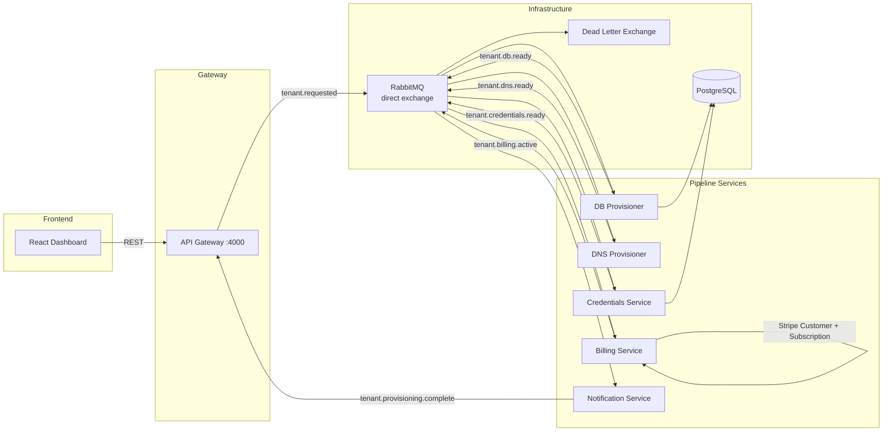
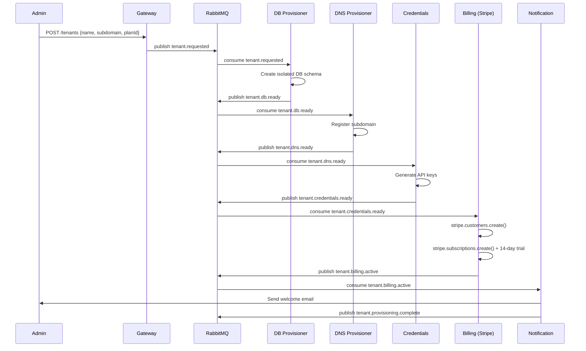
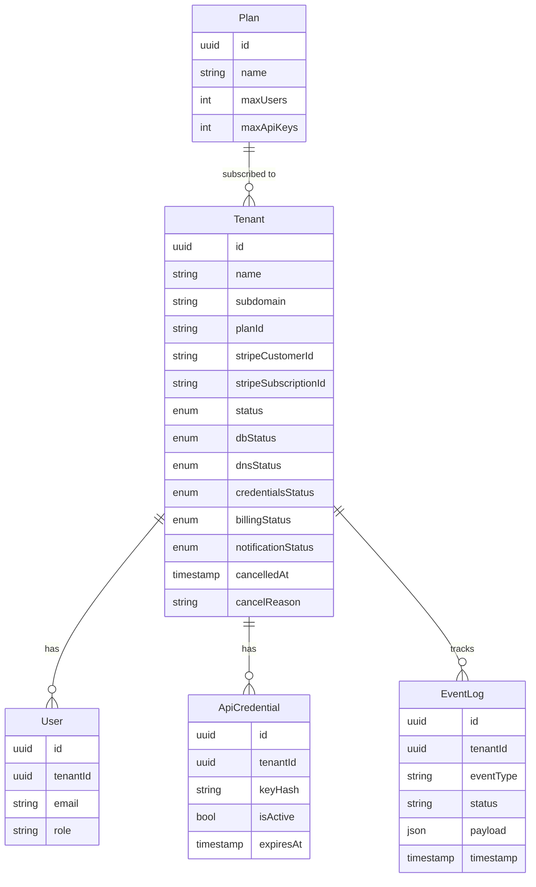

# TenantOps — Multi-Tenant SaaS Provisioning Platform

A production-grade microservices platform that automates the full lifecycle of tenant provisioning through an event-driven pipeline. Built to demonstrate distributed systems design, Stripe billing integration, and choreography-based saga patterns.

## Table of Contents

- [System Architecture](#system-architecture)
- [Services](#services)
- [Event-Driven Pipeline](#event-driven-pipeline)
- [Data Model](#data-model)
- [Auth and Security](#auth-and-security)
- [API Reference](#api-reference)
- [Getting Started](#getting-started)
- [Deployment](#deployment)
- [Engineering Decisions](#engineering-decisions)
- [Testing](#testing)
- [Roadmap and Known Gaps](#roadmap-and-known-gaps)

---

## System Architecture



---

## Services

| Service | Port | Description |
|---------|------|-------------|
| api-gateway | 4000 | Single entry point — rate limiting, routing, auth forwarding |
| tenant-service | 3001 | Core orchestration — tenant CRUD, pipeline state tracking |
| db-provisioner-service | 3002 | Creates isolated PostgreSQL schema per tenant |
| credentials-service | 3003 | Generates and stores API keys per tenant |
| dns-provisioner-service | 3004 | Registers subdomain DNS records |
| billing-service | 3005 | Creates Stripe customer and subscription with 14-day trial |
| notification-service | 3006 | Sends welcome email and publishes provisioning.complete |

### API Gateway

Single entry point for all client requests. Applies rate limiting (100 req/min per IP, stricter on auth routes), logs all traffic via Pino, and proxies to downstream services.

### Tenant Service

Core orchestration service. Manages the provisioning state machine and subscribes to all pipeline events to keep per-step status accurate. Runs a scheduled job every 5 minutes to auto-cancel pipelines stuck for more than 30 minutes.

Provisioning states: `PROVISIONING → ACTIVE | FAILED | CANCELLED`

Step statuses: `PENDING → IN_PROGRESS → SUCCESS | FAILED | CANCELLED`

### Billing Service

Subscribes to `tenant.credentials.ready`. Validates Stripe Price IDs at startup (fails fast if any env var is missing). Creates a Stripe Customer and Subscription with a 14-day trial, then publishes `tenant.billing.active` with the real Stripe IDs.

---

## Event-Driven Pipeline



### Message Broker Configuration

- Exchange: `provisioning.direct` (direct, durable)
- Dead letter exchange: `dlx.provisioning` (durable)
- Each queue has a dead letter routing key for failed message inspection
- `prefetchCount: 10` on all consumers

### Shared Event Types

Defined in `packages/shared-types` and consumed by all services:

```typescript
interface TenantRequestedPayload   { tenantId; subdomain; planId }
interface TenantDbReadyPayload     { tenantId; subdomain; planId }
interface TenantDnsReadyPayload    { tenantId; subdomain; planId }
interface TenantCredentialsReadyPayload { tenantId; subdomain; planId }
interface TenantBillingActivePayload {
  tenantId; subdomain; planId;
  stripeCustomerId; stripeSubscriptionId;
  subscriptionStatus; trialEnd: string | null;
}
interface ProvisioningCompletePayload { tenantId; subdomain }
```

---

## Data Model



---

## Auth and Security

- JWT with `sub`, `email`, `role`, `tenantId` claims
- bcrypt password hashing
- Single-use refresh token rotation
- Rate limiting per IP at gateway level
- CORS with configurable origin whitelist
- Helmet security headers
- `class-validator` decorators on all DTOs

```typescript
// JWT payload shape
{
  sub: string;       // user ID
  email: string;
  role: 'ADMIN' | 'USER';
  tenantId: string;
}
```

---

## OpenAPI

Both `api-gateway` and `tenant-service` expose interactive Swagger UI at
`/api/docs` (e.g. `http://localhost:4000/api/docs`). The spec is generated
from `class-validator` decorators on the shared DTOs in
`packages/shared-types`, so request schemas stay in lockstep with runtime
validation.

## API Reference

### Auth

| Method | Endpoint | Description |
|--------|----------|-------------|
| POST | `/auth/register` | Register new user |
| POST | `/auth/login` | Login and receive tokens |
| POST | `/auth/refresh` | Refresh access token |
| POST | `/auth/logout` | Invalidate refresh token |
| GET | `/auth/me` | Get current user |

### Tenants

| Method | Endpoint | Description |
|--------|----------|-------------|
| GET | `/tenants` | List all tenants |
| POST | `/tenants` | Create tenant and start provisioning |
| GET | `/tenants/:id` | Get tenant with step statuses |
| DELETE | `/tenants/:id` | Delete tenant and clean up resources |
| POST | `/tenants/:id/cancel` | Cancel in-progress provisioning |
| GET | `/tenants/:id/events` | Get event log for tenant |

---

## Getting Started

### Prerequisites

- Node.js 20+
- Docker and Docker Compose

### Quick Start

```bash
git clone https://github.com/Olayanju-1234/liftoff.git
cd liftoff
npm install

# Start PostgreSQL and RabbitMQ
docker-compose up -d postgres_db rabbitmq

# Copy and fill env files for each service
cp backend/tenant-service/.env.example backend/tenant-service/.env
# ... repeat for other services

# Run migrations
cd backend/tenant-service && npx prisma migrate dev && cd ../..
cd backend/db-provisioner-service && npx prisma migrate dev && cd ../..
cd backend/credentials-service && npx prisma migrate dev && cd ../..

# Start all services
npm run dev
```

### Running a Single Service

```bash
cd backend/billing-service && npm run start:dev
```

---

## Deployment

Deployed on Render using Docker. Each service has its own web service instance built from the monorepo root context.

A `render.yaml` at the repo root defines all service configurations with `dockerContext: .` to ensure the Dockerfiles can resolve workspace dependencies correctly.

### Environment Variables per Service

**All services:**
- `NODE_ENV`, `PORT`, `RABBITMQ_URL`

**Tenant Service, DB Provisioner, Credentials Service:**
- `DATABASE_URL` (PostgreSQL connection string)

**Billing Service:**
- `STRIPE_SECRET_KEY`, `STRIPE_PRICE_STARTER`, `STRIPE_PRICE_PRO`, `STRIPE_PRICE_ENTERPRISE`

**Notification Service:**
- `SENDGRID_API_KEY`, `SENDGRID_FROM_EMAIL`

---

## Engineering Decisions

### Choreography-based saga (not orchestration)

Each service reacts to events independently rather than a central orchestrator directing the flow. This means:
- No single point of failure in the pipeline
- Services can be deployed and scaled independently
- Adding a new pipeline step only requires publishing a new event type

### RabbitMQ over Kafka

Direct exchange routing is sufficient at this scale. RabbitMQ's at-least-once delivery with acknowledgments, dead letter queues, and simpler operational profile made it the right choice for a task-queue workload.

### Billing service fails fast on startup

`buildPlanPriceMap()` validates all Stripe Price ID environment variables at module load time. If any are missing, the service refuses to start. This prevents the scenario where a subscription is attempted with an empty price ID, which would throw a Stripe API error at the worst possible moment (mid-provisioning, after the customer was already created).

### Database-per-tenant via schema isolation

Each tenant gets an isolated PostgreSQL schema rather than shared tables. This prevents data leakage between tenants, simplifies backup/restore per tenant, and allows per-tenant migrations without affecting others.

### Strict configuration validation at startup

Every service runs a Joi schema (`config/env.validation.ts`) over `process.env`
before the Nest container boots. Required values like `DATABASE_URL`,
`RABBITMQ_URL`, `JWT_SECRET`, and `JWT_REFRESH_SECRET` must be present and well
formed. JWT secrets must be at least 32 chars. Missing or malformed config
crashes boot with a single actionable error instead of producing 5xxs in
production at the worst possible moment.

`auth.service` correspondingly uses `configService.getOrThrow()` rather than
`get(...) || 'default'` fallbacks for any cryptographic secret — there are no
silent fallbacks to a known-weak value anywhere in the code path.

### Shared DTOs in `packages/shared-types`

All HTTP-facing DTOs live in a single workspace package and are imported by
both the gateway and the tenant service. One source of truth for the request
contract, one set of `class-validator` rules, one set of `@nestjs/swagger`
annotations, no drift.

---

## Testing

Unit tests cover the saga's brain — `auth.service` and `tenants.service` —
with the database, JWT signer, and RabbitMQ connection all mocked. Tests
focus on:

- State transitions (saga step advancement, `PROVISIONING → ACTIVE`)
- Error semantics (`ConflictException`, `NotFoundException`,
  `BadRequestException`, `UnauthorizedException`)
- Security invariants (refresh tokens stored hashed, no existence-leak on
  unknown emails, no plaintext secrets in DB writes)
- Ordering invariants (e.g. `tenant.deleted` is published *before* the row
  is removed, so consumers can still read tenant context)
- Prisma error translation (`P2002` → `ConflictException`)

```bash
cd backend/tenant-service && npm test
# Test Suites: 2 passed, 2 total
# Tests:       23 passed, 23 total
```

---

## Roadmap and Known Gaps

These are the items that would come next if I were continuing on this codebase.
Calling them out explicitly because senior engineering is as much about knowing
where the cracks are as it is about the code that ships.

- **Transactional outbox for event publication.** Today the DB write and the
  RabbitMQ publish are not atomic — a process crash between them leaves the
  saga stuck until the 30-min timeout sweep. Design captured in
  [`docs/adr/0001-outbox-pattern.md`](docs/adr/0001-outbox-pattern.md).
- **Idempotency keys on saga handlers.** RabbitMQ guarantees at-least-once
  delivery; consumers should dedupe on `(tenantId, eventType)` rather than
  trusting that a duplicate redelivery will be a no-op.
- **OpenTelemetry tracing.** Add an OTel collector and propagate trace
  context across the RabbitMQ message headers. The current Pino logs are
  great per-service but stitching a single tenant's pipeline together
  across six services is manual.
- **Contract tests** (Pact or schema-snapshot) between producers and
  consumers of every RabbitMQ event, so a payload field rename can't ship
  without updating downstream consumers.
- **API gateway → tenant-service auth propagation.** Currently the gateway
  forwards the user's bearer token verbatim. Long-term, mint a short-lived
  service-to-service JWT signed by the gateway so downstream services can
  trust origin without re-validating the user token on every hop.
- **Per-tenant rate limiting.** The throttler is currently per-IP; per-tenant
  quotas (especially on the `POST /tenants` endpoint) would prevent one
  noisy customer from monopolizing pipeline capacity.
- **Schema migrations as a deploy artifact.** Today migrations are applied
  on dev with `prisma migrate dev`. Production needs a separate
  `prisma migrate deploy` job that runs once per release before the new
  service version takes traffic.
