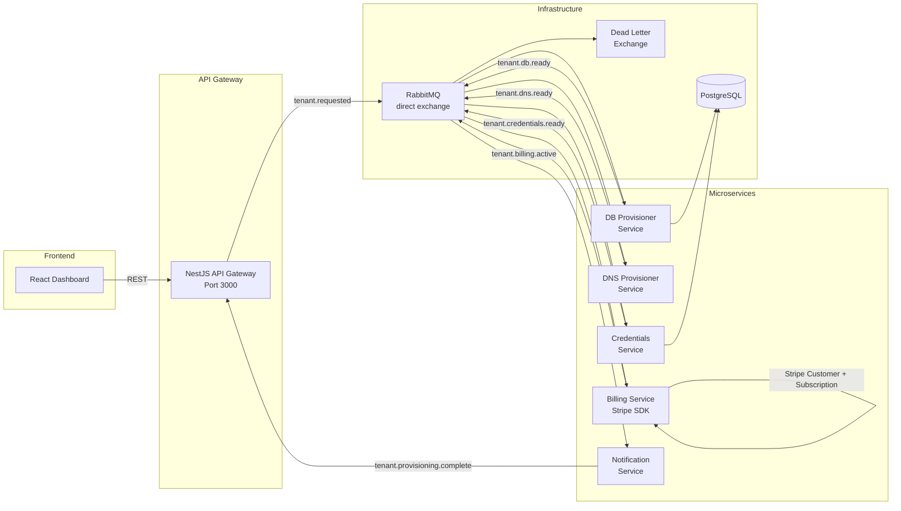
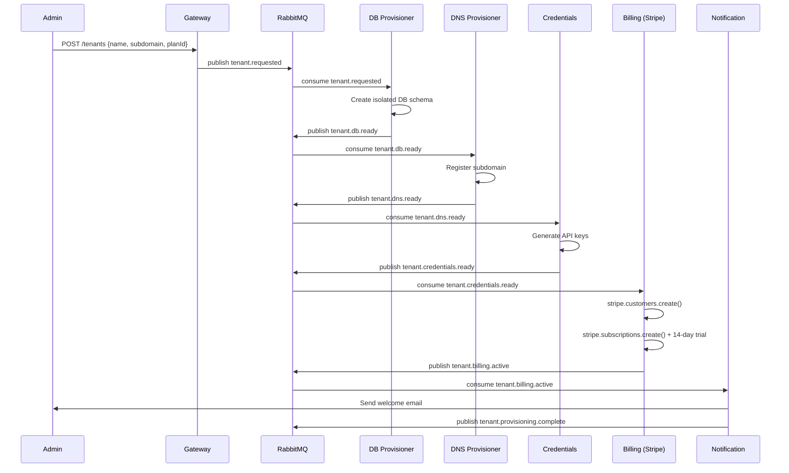
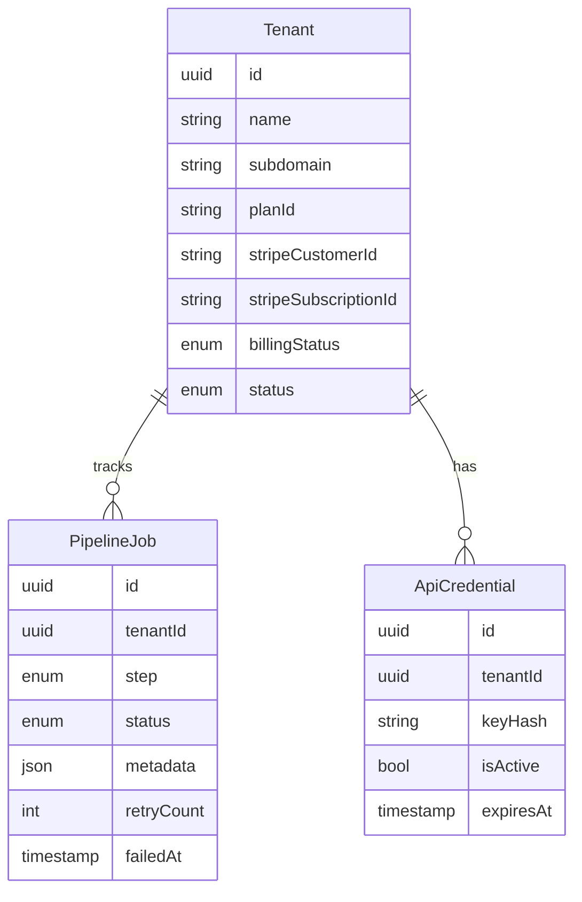

# 🏢 TenantOps - Multi-Tenant SaaS Provisioning Platform

> **A production-grade microservices platform for automated tenant provisioning, demonstrating advanced backend engineering patterns and distributed systems design.**

[](https://nestjs.com/)
[](https://www.typescriptlang.org/)
[](https://www.postgresql.org/)
[](https://www.rabbitmq.com/)
[](https://www.docker.com/)
[](https://www.prisma.io/)

---

## 📋 Table of Contents

- [Overview](#-overview)
- [System Architecture](#-system-architecture)
- [Backend Services](#-backend-services)
- [Event-Driven Architecture](#-event-driven-architecture)
- [Database Design](#-database-design)
- [Authentication & Security](#-authentication--security)
- [API Reference](#-api-reference)
- [Getting Started](#-getting-started)
- [Development](#-development)
- [Testing](#-testing)
- [Deployment](#-deployment)
- [Key Engineering Decisions](#-key-engineering-decisions)

---

## 🎯 Overview

TenantOps is a **multi-tenant SaaS provisioning platform** built to demonstrate enterprise-grade backend engineering skills. It automates the complete lifecycle of tenant provisioning through an event-driven microservices architecture.

### Key Features

- **Microservices Architecture** - 7 independently deployable services
- **Event-Driven Communication** - RabbitMQ message broker with durable queues
- **Automated Provisioning Pipeline** - 5-stage provisioning with real-time status tracking
- **JWT Authentication** - Secure token-based authentication with refresh token rotation
- **Rate Limiting** - Configurable API throttling at the gateway level
- **Database Per Tenant** - Isolated PostgreSQL schemas for each tenant
- **Graceful Degradation** - Dead letter queues and retry mechanisms
- **Pipeline Lifecycle Management** - Cancel, delete, and auto-timeout for stale pipelines

### Skills Demonstrated

| Category | Technologies & Patterns |
|----------|------------------------|
| **Backend Framework** | NestJS, Express, Node.js |
| **API Design** | RESTful APIs, API Gateway Pattern, DTO Validation |
| **Databases** | PostgreSQL, Prisma ORM, Database Migrations |
| **Message Brokers** | RabbitMQ, Pub/Sub, Dead Letter Queues |
| **Authentication** | JWT, OAuth 2.0, Passport.js, bcrypt |
| **DevOps** | Docker, Docker Compose, Health Checks |
| **Observability** | Pino Logger, Sentry, Structured Logging |
| **Architecture** | Microservices, Event Sourcing, CQRS-inspired patterns |
| **Code Quality** | TypeScript, ESLint, Prettier, Monorepo structure |

---

## 🏗 System Architecture

```
┌─────────────────────────────────────────────────────────────────────────────┐
│                              FRONTEND (React)                                │
│                           localhost:5173                                     │
└─────────────────────────────────┬───────────────────────────────────────────┘
                                  │
                                  ▼
┌─────────────────────────────────────────────────────────────────────────────┐
│                         API GATEWAY (NestJS)                                 │
│                         localhost:4000                                       │
│  ┌─────────────┐  ┌─────────────┐  ┌─────────────┐  ┌─────────────┐        │
│  │ Rate Limit  │  │   Routing   │  │   Logging   │  │   Proxying  │        │
│  └─────────────┘  └─────────────┘  └─────────────┘  └─────────────┘        │
└─────────────────────────────────┬───────────────────────────────────────────┘
                                  │
         ┌────────────────────────┼────────────────────────┐
         ▼                        ▼                        ▼
┌─────────────────┐    ┌─────────────────┐    ┌─────────────────┐
│  TENANT SERVICE │    │  AUTH SERVICE   │    │ SETTINGS SERVICE│
│  localhost:3001 │    │  (integrated)   │    │  (integrated)   │
│                 │    │                 │    │                 │
│ • CRUD Tenants  │    │ • JWT Auth      │    │ • User Prefs    │
│ • Event Publish │    │ • OAuth 2.0     │    │ • Notifications │
│ • Status Track  │    │ • Password Hash │    │                 │
└────────┬────────┘    └─────────────────┘    └─────────────────┘
         │
         │ RabbitMQ Events
         ▼
┌─────────────────────────────────────────────────────────────────────────────┐
│                         MESSAGE BROKER (RabbitMQ)                            │
│                         localhost:5672                                       │
│                                                                              │
│  Exchange: provisioning.direct (Direct Exchange)                             │
│  ┌──────────────────────────────────────────────────────────────────┐       │
│  │  tenant.requested → tenant.db.ready → tenant.dns.ready →         │       │
│  │  tenant.credentials.ready → tenant.billing.active →              │       │
│  │  tenant.provisioning.complete                                     │       │
│  └──────────────────────────────────────────────────────────────────┘       │
│                                                                              │
│  Dead Letter Exchange: dlx.provisioning                                      │
└──────┬──────────┬──────────┬──────────┬──────────┬──────────────────────────┘
       │          │          │          │          │
       ▼          ▼          ▼          ▼          ▼
┌──────────┐ ┌──────────┐ ┌──────────┐ ┌──────────┐ ┌──────────┐
│   DB     │ │   DNS    │ │CREDENTIAL│ │ BILLING  │ │  NOTIF   │
│PROVISIONER│ │PROVISIONER│ │ SERVICE  │ │ SERVICE  │ │ SERVICE  │
│  :3002   │ │  :3004   │ │  :3003   │ │  :3005   │ │  :3006   │
│          │ │          │ │          │ │          │ │          │
│ Postgres │ │ DNS Sim  │ │ API Keys │ │ Stripe   │ │ SendGrid │
│ Schemas  │ │ Records  │ │ Generate │ │ Subs     │ │ Emails   │
└──────────┘ └──────────┘ └──────────┘ └──────────┘ └──────────┘
```

---

## 🔧 Backend Services

### 1. API Gateway (`backend/api-gateway`)

The single entry point for all client requests. Implements the **API Gateway Pattern**.

**Responsibilities:**
- Request routing to downstream services
- Rate limiting (100 req/min per IP, stricter for auth endpoints)
- Request/Response logging with Pino
- Authentication header forwarding
- Health check endpoint aggregation

**Key Files:**
```
api-gateway/
├── src/
│   ├── app.controller.ts    # Route definitions
│   ├── app.service.ts       # HTTP proxy logic
│   └── app.module.ts        # DI configuration
```

**Rate Limiting Configuration:**
```typescript
ThrottlerModule.forRoot([{
  ttl: 60000,   // 1 minute window
  limit: 100,   // 100 requests max
}])
```

---

### 2. Tenant Service (`backend/tenant-service`)

The **core orchestration service** managing tenant lifecycle and provisioning state.

**Responsibilities:**
- Tenant CRUD operations
- Provisioning state machine management
- Event publishing for provisioning workflow
- RabbitMQ event consumption for status updates
- Scheduled job for auto-cancellation of stale pipelines

**Key Components:**

```typescript
// Provisioning State Machine
enum TenantStatus {
  PROVISIONING,  // Initial state
  ACTIVE,        // Fully provisioned
  SUSPENDED,     // Admin suspended
  FAILED,        // Provisioning failed
  CANCELLED      // User cancelled
}

enum StepStatus {
  PENDING,       // Not started
  IN_PROGRESS,   // Currently processing
  SUCCESS,       // Completed successfully
  FAILED,        // Failed with error
  CANCELLED      // Cancelled by user/timeout
}
```

**RabbitMQ Handlers:**
```typescript
@RabbitSubscribe({
  exchange: 'provisioning.direct',
  routingKey: 'tenant.db.ready',
  queue: 'tenant-service-db-ready-queue',
})
async handleDbReady(msg: TenantDbReadyPayload) {
  // Update tenant dbStatus to SUCCESS
  // Trigger next step...
}
```

**Auto-Timeout Service:**
```typescript
@Cron(CronExpression.EVERY_5_MINUTES)
async handleProvisioningTimeout() {
  // Find tenants stuck in PROVISIONING for > 30 minutes
  // Auto-cancel with reason
}
```

---

### 3. DB Provisioner Service (`backend/db-provisioner-service`)

Creates isolated database schemas for each tenant.

**Event Flow:**
```
tenant.requested → [DB Provisioner] → tenant.db.ready
```

**Implementation:**
```typescript
@RabbitSubscribe({
  exchange: 'provisioning.direct',
  routingKey: 'tenant.requested',
  queue: 'db-provisioner-queue',
})
async handleTenantRequested(msg: TenantRequestedPayload) {
  // 1. Create PostgreSQL schema for tenant
  // 2. Run migrations
  // 3. Publish tenant.db.ready event
}
```

---

### 4. DNS Provisioner Service (`backend/dns-provisioner-service`)

Configures DNS records for tenant subdomains.

**Event Flow:**
```
tenant.db.ready → [DNS Provisioner] → tenant.dns.ready
```

**Simulated DNS Operations:**
- A record creation for subdomain
- CNAME configuration
- SSL certificate provisioning (simulated)

---

### 5. Credentials Service (`backend/credentials-service`)

Generates and stores API keys and secrets for tenant applications.

**Event Flow:**
```
tenant.dns.ready → [Credentials Service] → tenant.credentials.ready
```

**Security Measures:**
- API keys generated with crypto-secure random bytes
- Keys hashed before storage
- Rate-limited key regeneration

---

### 6. Billing Service (`backend/billing-service`)

Integrates with Stripe for subscription management.

**Event Flow:**
```
tenant.credentials.ready → [Billing Service] → tenant.billing.active
```

**Stripe Integration:**
- Customer creation
- Subscription management
- Webhook handling (expandable)

---

### 7. Notification Service (`backend/notification-service`)

Sends emails via SendGrid for tenant lifecycle events.

**Event Flow:**
```
tenant.billing.active → [Notification Service] → tenant.provisioning.complete
```

**Email Templates:**
- Welcome email
- Provisioning complete
- Failed job alerts

---

## 📨 Event-Driven Architecture

### Event Schema (TypeScript)

```typescript
// Shared types package: @liftoff/shared-types

interface TenantRequestedPayload {
  tenantId: string;
  subdomain: string;
  planId: string;
}

interface TenantDbReadyPayload {
  tenantId: string;
  subdomain: string;
  planId: string;
  schemaName?: string;
}

interface ProvisioningCompletePayload {
  tenantId: string;
  subdomain: string;
}
```

### Message Broker Configuration

```typescript
RabbitMQModule.forRoot({
  exchanges: [
    {
      name: 'provisioning.direct',
      type: 'direct',
      options: { durable: true },
    },
    {
      name: 'dlx.provisioning',
      type: 'direct',
      options: { durable: true },
    },
  ],
  uri: process.env.RABBITMQ_URL,
  prefetchCount: 10,
  enableControllerDiscovery: true,
})
```

### Dead Letter Queue Pattern

Failed messages are routed to a dead letter exchange for:
- Manual inspection
- Retry processing
- Failure analytics

---

## 🗄 Database Design

### Entity Relationship Diagram

```
┌─────────────┐       ┌─────────────┐       ┌─────────────┐
│    Plan     │       │   Tenant    │       │    User     │
├─────────────┤       ├─────────────┤       ├─────────────┤
│ id          │◄──────│ planId      │       │ id          │
│ name        │       │ id          │◄──────│ tenantId    │
│ maxUsers    │       │ name        │       │ email       │
│ maxApiKeys  │       │ subdomain   │       │ password    │
└─────────────┘       │ status      │       │ role        │
                      │ dbStatus    │       │ provider    │
                      │ dnsStatus   │       └─────────────┘
                      │ ...         │
                      │ cancelledAt │       ┌─────────────┐
                      │ cancelReason│       │ EventLog    │
                      └──────┬──────┘       ├─────────────┤
                             │              │ id          │
                             └──────────────│ tenantId    │
                                            │ eventType   │
                                            │ status      │
                                            │ payload     │
                                            └─────────────┘
```

### Prisma Schema Highlights

```prisma
model Tenant {
  id        String       @id @default(cuid())
  name      String       @unique
  subdomain String       @unique
  status    TenantStatus @default(PROVISIONING)
  
  // Step statuses for pipeline tracking
  dbStatus          StepStatus @default(PENDING)
  dnsStatus         StepStatus @default(PENDING)
  credentialsStatus StepStatus @default(PENDING)
  billingStatus     StepStatus @default(PENDING)
  notificationStatus StepStatus @default(PENDING)
  
  // Cancellation tracking
  cancelledAt  DateTime?
  cancelReason String?
  
  // Relations
  plan   Plan      @relation(fields: [planId], references: [id])
  users  User[]
  events EventLog[]
}
```

---

## 🔐 Authentication & Security

### JWT Implementation

```typescript
// Token structure
{
  sub: "user_id",
  email: "user@example.com",
  role: "ADMIN" | "USER",
  tenantId: "tenant_id",
  iat: 1234567890,
  exp: 1234567890
}
```

### Security Features

| Feature | Implementation |
|---------|---------------|
| Password Hashing | bcrypt with salt rounds |
| Token Rotation | Refresh token with single-use |
| Rate Limiting | Per-IP throttling at gateway |
| CORS | Configurable origin whitelist |
| Helmet | Security headers middleware |
| Input Validation | class-validator decorators |

### OAuth 2.0 Support

- Google OAuth integration
- GitHub OAuth integration
- Provider-agnostic user model

### Guard Implementation

```typescript
@Injectable()
export class JwtAuthGuard extends AuthGuard('jwt') {
  canActivate(context: ExecutionContext) {
    // Skip for non-HTTP contexts (RabbitMQ handlers)
    if (context.getType() !== 'http') {
      return true;
    }
    
    // Check @Public() decorator
    const isPublic = this.reflector.getAllAndOverride<boolean>(
      IS_PUBLIC_KEY,
      [context.getHandler(), context.getClass()]
    );
    
    return isPublic || super.canActivate(context);
  }
}
```

---

## 📡 API Reference

### Authentication Endpoints

| Method | Endpoint | Description |
|--------|----------|-------------|
| POST | `/auth/register` | Register new user |
| POST | `/auth/login` | Login with credentials |
| POST | `/auth/refresh` | Refresh access token |
| POST | `/auth/logout` | Invalidate refresh token |
| GET | `/auth/me` | Get current user profile |

### Tenant Endpoints

| Method | Endpoint | Description |
|--------|----------|-------------|
| GET | `/tenants` | List all tenants |
| POST | `/tenants` | Create new tenant |
| GET | `/tenants/:id` | Get tenant details |
| DELETE | `/tenants/:id` | Delete tenant |
| POST | `/tenants/:id/cancel` | Cancel provisioning |
| GET | `/tenants/:id/events` | Get tenant events |

### Settings Endpoints

| Method | Endpoint | Description |
|--------|----------|-------------|
| GET | `/settings` | Get user settings |
| PUT | `/settings` | Update user settings |

---

## 🚀 Getting Started

### Prerequisites

- Node.js 20+
- Docker & Docker Compose
- npm or pnpm

### Quick Start

```bash
# 1. Clone the repository
git clone https://github.com/yourusername/tenant-provisioning-platform.git
cd tenant-provisioning-platform

# 2. Install dependencies
npm install

# 3. Start infrastructure (PostgreSQL, RabbitMQ, Redis)
docker-compose up -d postgres rabbitmq redis

# 4. Copy environment files
cp backend/tenant-service/.env.example backend/tenant-service/.env
cp backend/api-gateway/.env.example backend/api-gateway/.env
# ... repeat for other services

# 5. Run database migrations
cd backend/tenant-service && npx prisma migrate dev

# 6. Start all services
npm run dev
```

### Environment Variables

See [ENV_KEYS_GUIDE.md](./ENV_KEYS_GUIDE.md) for a complete list of environment variables.

---

## 💻 Development

### Project Structure

```
tenant-provisioning-platform/
├── backend/
│   ├── api-gateway/           # API Gateway service
│   ├── tenant-service/        # Core tenant management
│   ├── db-provisioner-service/# Database provisioning
│   ├── dns-provisioner-service/# DNS configuration
│   ├── credentials-service/   # API key management
│   ├── billing-service/       # Stripe integration
│   └── notification-service/  # Email notifications
├── frontend/                  # React dashboard
├── packages/
│   └── shared-types/         # Shared TypeScript types
├── docker-compose.yml        # Infrastructure setup
└── README.md
```

### Running Individual Services

```bash
# API Gateway
cd backend/api-gateway && npm run start:dev

# Tenant Service
cd backend/tenant-service && npm run start:dev

# All services in parallel (from root)
npm run dev
```

### Code Quality

```bash
# Lint all services
npm run lint

# Format code
npm run format

# Type check
npm run typecheck
```

---

## 🧪 Testing

### Unit Tests

```bash
cd backend/tenant-service
npm run test
```

### E2E Tests

```bash
cd backend/tenant-service
npm run test:e2e
```

### Manual Testing with cURL

```bash
# Register a user
curl -X POST http://localhost:4000/auth/register \
  -H "Content-Type: application/json" \
  -d '{"email":"test@example.com","password":"password123","name":"Test User"}'

# Login
curl -X POST http://localhost:4000/auth/login \
  -H "Content-Type: application/json" \
  -d '{"email":"test@example.com","password":"password123"}'

# Create a tenant (with JWT token)
curl -X POST http://localhost:4000/tenants \
  -H "Content-Type: application/json" \
  -H "Authorization: Bearer YOUR_JWT_TOKEN" \
  -d '{"name":"Acme Corp","subdomain":"acme","planId":"basic"}'
```

---

## 🐳 Deployment

### Docker Compose (Development)

```bash
docker-compose up -d
```

### Production Considerations

- [ ] Use managed PostgreSQL (AWS RDS, Cloud SQL)
- [ ] Use managed RabbitMQ (CloudAMQP, Amazon MQ)
- [ ] Configure proper secrets management (Vault, AWS Secrets Manager)
- [ ] Set up monitoring (Prometheus, Grafana)
- [ ] Configure log aggregation (ELK Stack, Datadog)
- [ ] Implement CI/CD pipelines

---

## 🧠 Key Engineering Decisions

### Why Microservices?

- **Independent Scaling**: Scale billing service separately during peak subscription periods
- **Technology Flexibility**: Each service can use optimal tech stack
- **Fault Isolation**: Failure in notification service doesn't affect core provisioning
- **Team Autonomy**: Different teams can own different services

### Why RabbitMQ over Kafka?

- **Use Case Fit**: Task queues and RPC-style communication
- **Simpler Operations**: Lower operational complexity for this scale
- **Delivery Guarantees**: At-least-once delivery with acknowledgments
- **Routing Flexibility**: Direct exchanges for targeted message delivery

### Why NestJS?

- **TypeScript First**: Strong typing throughout
- **Dependency Injection**: Testable, modular code
- **Decorators**: Clean, declarative code style
- **Ecosystem**: First-class support for common patterns (GraphQL, WebSockets, microservices)

### Saga Pattern for Provisioning

The provisioning workflow implements a **choreography-based saga**:

1. Each service listens for its trigger event
2. Each service publishes completion event
3. Tenant service tracks aggregate state
4. Compensation actions for failures (planned)

---

## 📊 Observability

### Logging Strategy

All services use **structured logging** with Pino:

```typescript
LoggerModule.forRoot({
  pinoHttp: {
    transport: {
      target: 'pino-pretty',
      options: { singleLine: true, colorize: true },
    },
    level: process.env.LOG_LEVEL || 'info',
  },
})
```

### Health Checks

Each service exposes `/health` endpoint:

```json
{
  "status": "ok",
  "timestamp": "2024-01-01T00:00:00.000Z"
}
```

### Sentry Integration

Error tracking configured for production:

```typescript
Sentry.init({
  dsn: process.env.SENTRY_DSN,
  environment: process.env.NODE_ENV,
});
```

---

## 📝 License

MIT License - feel free to use this project for learning and portfolio purposes.

---

## 🤝 Contributing

Contributions are welcome! Please read our contributing guidelines before submitting PRs.

---

**Built with ❤️ to demonstrate production-grade backend engineering skills.**

---

## System Architecture



## Provisioning Pipeline



## Data Model — ERD



